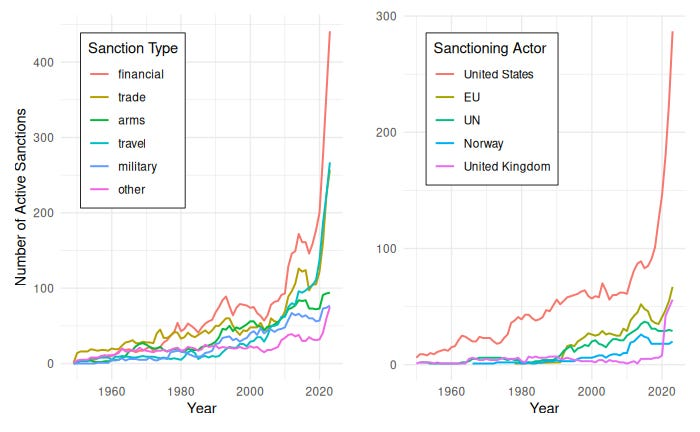

, via [Wikimedia Commons](https://commons.wikimedia.org/wiki/File:Moscow,_Neglinnaya_12,_Central_Bank.jpg); [IMG Academy](https://looking-for-soccer.com/en-us/soccer-camps-club/img-academy-en-us/img-academy-florida/).](images/EconomicSanctions_Sanctioned.jpg)

Economic sanctions have featured prominently in the Strait of Hormuz crisis and U.S.-Iran negotiations; what do we know about sanctions? Do they accomplish their goals? How do they affect nations? And how might the current use of economic sanctions shape the world? This post reviews what the research literature has to say. 

## What are sanctions?

Economic sanctions are laws restricting interstate exchange to coerce the target state into policy change, contain it, or deny it resources. Governments enforce sanctions by imposing fines, imprisonment, and other penalties on anyone within their jurisdiction who violates them. In other words, sanctions are laws used by one state to restrict interaction with another state to cause the target state harm. 

Sanctions coercing policy change have a policy demand and promise to end once that demand is met. For example, a state may impose economic sanctions on another until they uphold human rights, end a military action, release a prisoner, or hold an election. Sanctions for containment or denial usually do not have a clear path to ending them. For example, the United States placed sanctions on exporting semiconductors to China to prevent its rival from accessing cutting-edge technology, and there is nothing that China can do to have them lifted.^[Drezner, Daniel W. 2024. “Global Economic Sanctions.” Annual Review of Political Science 27(1): 9–24. doi:10.1146/annurev-polisci-041322-032240.]

Sanctions take many different forms; let’s look at an example. As of June 2026, the [European Union’s sanctions against Russia](https://www.consilium.europa.eu/en/policies/sanctions-against-russia-explained/#exportban) for invading Ukraine include:

* Bans on the import of certain goods into the EU from Russia (e.g., oil, natural gas, diamonds) and the export of certain goods from the EU to Russia (e.g., cutting-edge technology, aviation equipment, luxury goods)
* Bans in the EU on transactions with the Russian Central Bank and other institutions
* Asset freezes of certain entities (e.g., political parties, paramilitary groups, companies in certain sectors), meaning any assets in EU banks are frozen, and EU actors are prohibited from providing any funds or assets to them
* Travel bans and asset freezes on individuals (e.g., Vladimir Putin, government officials, prominent businesspeople) that prevent their transit to or through the EU and freeze their assets

It is the responsibility of the people in the country imposing sanctions to follow those sanctions. A sports academy in Florida [paid a $1.7 million penalty](https://ofac.treasury.gov/media/935006/download?inline) this year for enrolling two student-athletes without realizing they were children of individuals sanctioned for providing financial services to a sanctioned Mexican Drug Trafficking Organization. U.S. sanctions on other countries have consequences for the target country and for U.S. citizens.

Governments may also penalize individuals outside of their jurisdiction for violating sanctions. An India-based company recently [paid a $275 million penalty](https://ofac.treasury.gov/media/935631/download?inline) for purchasing Iranian products from a United Arab Emirates-based company. The trade violated U.S. sanctions against Iran because the transactions were processed in U.S. dollars through U.S. financial institutions. Foreign firms may also be targeted by [secondary sanctions](https://ofac.treasury.gov/media/935656/download?inline), where anyone doing business with a sanctioned country will be banned from doing business with the sanctioning country. For example, the United States [added](https://home.treasury.gov/news/press-releases/jy1978) the Dubai-based company Aspect DWC LLC to its [sanctions list](https://sanctionssearch.ofac.treas.gov/Details.aspx?id=46511) for trading aircraft parts with Russia.

Sanctions have become a principal tool for the U.S. to address a range of geopolitical situations; the Department of the Treasury said sanctions became the United States’ “[tool of first resort](https://home.treasury.gov/system/files/136/Treasury-2021-sanctions-review.pdf)” after 9-11. As other geopolitical punishments and incentives, like military action and foreign aid, have become costlier or less popular, economic sanctions offer a relatively cheap way for officials to show their constitutents that they are taking action against the adversary.^[Drezner, Daniel W. 2021. “The United States of Sanctions.” Foreign Affairs 100(5): 142–54.]

The Global Sanctions Data Base contains 1,547 cases of sanctions from 1950 to 2023. It tracks the sender state(s), the target state, and the type of sanction. The data show that the use of economic sanctions has grown over time, with a rapid increase in the last 10 years, especially financial sanctions and trade sanctions; this growth can largely be attributed to the United States, the greatest user of sanctions by far, as seen in Figure 2.^[Felbermayr, Gabriel, Aleksandra Kirilakha, Constantinos Syropoulos, Erdal Yalcin, and Yoto V. Yotov. 2020. “The Global Sanctions Data Base.” European Economic Review 129: 103561.
Yalcin, Erdal, Gabriel Felbermayr, Heider Kariem, Aleksandra Kirilakha, Ohyun Kwon, Constantinos Syropoulos, and Yoto V. Yotov. 2025. “The Global Sanctions Data Base—Release 4: The Heterogeneous Effects of the Sanctions on Russia.” The World Economy 48(9): 2003–17. doi:10.1111/twec.13732.]

## Do Sanctions Work?

If the goal of economic sanctions is to coerce the target state into policy change or to constrain it, how often do they succeed in their goals? 

According to the Global Sanctions Data Base, 64% of economic sanction objectives ended in total or partial success.^[If we include the large number of ongoing sanctions, the total and partial success rate falls to 37%.] The other major tracker of economic sanctions is the Threat and Imposition of Sanctions (TIES) dataset with information on 1,412 threatened or imposed sanctions from 1945 to 2005.^[Morgan, T. Clifton, Navin Bapat, and Yoshiharu Kobayashi. 2014. “Threat and Imposition of Economic Sanctions 1945–2005: Updating the TIES Dataset.” Conflict Management and Peace Science 31(5): 541–58. doi:10.1177/0738894213520379.] It finds that 33% of target states make at least partial concessions when sanctions are imposed. Interestingly, the TIES data show that the threat of sanctions alone leads to partial concessions 43% of the time.

Research shows that sanctions are more likely to succeed when the target is more dependent on trade with the sanctioning country and when the sanctions are imposed by a coalition of countries or a multinational organization, such as the United Nations or the European Union.FOOTNOTE[Drezner 2024; Felbermayr, Gabriel, T. Clifton Morgan, Constantinos Syropoulos, and Yoto V. Yotov. 2025. “Economic Sanctions: Stylized Facts and Quantitative Evidence.” Annual Review of Economics 17(1): 175–95. doi:10.1146/annurev-economics-081623-020909.] These factors make the sanctions more successful because the sanctions are more costly for the target country. The term ‘weaponized interdependence’ describes how a country’s increased trade dependence gives its trade partners greater leverage to make policy demands under the threat of sanctions.FOOTNOTE[Farrell, Henry, and Abraham L. Newman. 2019. “Weaponized Interdependence: How Global Economic Networks Shape State Coercion.” International Security 44(1): 42–79. doi:10.1162/isec_a_00351.] 

Sanctions are also more likely to succeed if the demands are clear and precise, are within the target’s control, and are less significant for the target.^[Felbermayr et al 2025.] This helps explain why sanctions are less likely to succeed on objectives that are less clear or actionable, like terrorism (9%), or are high-stakes, like territorial conflict (29%), than on objectives like human rights (40%) and democracy (61%).^[Percentages are based on partial or total success according to the Global Sanction Data Base.]

States are also more likely to acquiesce when they are sanctioned by an ally, which may be because allies understand each other better or have an easier time credibly committing to not impose sanctions in the future, two [well-known barriers](https://abroadreview.com/posts/HowWarsEnd.html) to resolving conflict.^[Drezner, Daniel W. 1999. The Sanctions Paradox: Economic Statecraft and International Relations. Cambridge: Cambridge University Press. doi:10.1017/CBO9780511549366.
Walentek, Dawid, Joris Broere, Matteo Cinelli, Mark M. Dekker, and Jonas M. B. Haslbeck. 2021. “Success of Economic Sanctions Threats: Coercion, Information and Commitment.” International Interactions 47(3): 417–48. doi:10.1080/03050629.2021.1860034.]

While informative, these findings are all general and any individual case may vary greatly. As to the usefulness of sanctions, the rate of success should be assessed along with other considerations. An economic sanction may fall short of its main objective but still accomplish other goals; likewise, a successful sanction may have costly side effects. A better question would be whether an economic sanction led to better outcomes than other options such as doing nothing or using military force.^[Council on Foreign Relations. 2024. “What Are Economic Sanctions?” https://www.cfr.org/backgrounders/what-are-economic-sanctions (June 30, 2026).]

## What are the consequences of sanctions?

Beyond geopolitical pressure, sanctions can have significant consequences on the targeted country. Research shows U.S. sanctions decrease a target state’s GDP growth rate by about 1 percentage point on average; U.N. sanctions can decrease the GDP growth rate even further, by 2 percentage points.[Neuenkirch, Matthias, and Florian Neumeier. 2015. “The Impact of UN and US Economic Sanctions on GDP Growth.”^European Journal of Political Economy 40: 110–25.] Accompanying the decrease in growth is an increase in a country’s poverty gap, a measure of both the frequency and depth of poverty.^[Neuenkirch, Matthias, and Florian Neumeier. 2016. “The Impact of US Sanctions on Poverty.” Journal of Development Economics 121: 110–19.] The greater the intensity of sanctions, the greater their effects on the growth rate and poverty gap. Sanctions also increase economic inequality in a state, suggesting they disproportionately affect the most vulnerable.^[Afesorgbor, Sylvanus Kwaku, and Renuka Mahadevan. 2016. “The Impact of Economic Sanctions on Income Inequality of Target States.” World Development 83: 1–11.] 

The consequences of sanctions extend beyond economic measures. Research has found that sanctioned countries suffer increases in disease and infant mortality and decreases in life expectancy. Multiple studies have also found that sanctions are gendered, with women affected more severely than men.^[Drezner 2024.] 

The consequences in the country imposing sanctions are generally minor, likely due to the usual power imbalance. A country that imposes sanctions generally has a larger economy than the target. Of the two countries, the one with the smaller economy has greater economic dependence and thus incurs higher costs from the sanctions.^[Morgan, T. Clifton, Constantinos Syropoulos, and Yoto V. Yotov. 2023. “Economic Sanctions: Evolution, Consequences, and Challenges.” Journal of Economic Perspectives 37(1): 3–29. doi:10.1257/jep.37.1.3.] Sanctioning countries can also design sanctions to minimize their own costs.^[Felbermayr et al 2025] For example, after Russia invaded Ukraine in 2022, the initial EU sanctions on Russian oil [allowed an exemption](https://ec.europa.eu/commission/presscorner/detail/it/qanda_22_7653) for import-dependent members Hungary and Slovakia, as such a sanction would be especially costly to them. Sanctioning countries do suffer some economic costs when sanctioning larger countries due to decreased economic activity as firms react to uncertainty, and often from the target state imposing retaliatory sanctions back on the sender.^[Gutmann, Jerg, Matthias Neuenkirch, and Florian Neumeier. 2023. “The Impact of Economic Sanctions on Target Countries: A Review of the Empirical Evidence.” EconPol Forum 24(3): 5–9.]

## The trade war arms race

The increased use of economic sanctions has given rise to a sort of trade war arms race wherein countries employ new strategies to decrease the impact of their adversaries’ sanctions. After experiencing sanctions for its 2014 Crimea annexation, Russia employed several ‘sanctions-proofing’ strategies:^[Glenn, Caileigh. 2023. “Lessons in Sanctions-Proofing from Russia.” The Washington Quarterly 46(1): 105–20. doi:10.1080/0163660X.2023.2188829.] 

* It adopted protectionist policies for strategic sectors by supporting them with oil and gas revenues, especially domestic manufacturing. 
* It provided financial protections such as a tax-free zone for Russian investments returning from overseas. 
* It developed new partnerships with China and held a collaboration summit with 43 African countries.
* It demonstrated its ability to impose retaliatory sanctions, as when it banned Canadian agricultural products
* It reduced its use of the U.S. dollar by exchanging its reserves for other currencies

At the same time, sanctioning states are also taking steps to make sanctions more efficient. Earlier we showed how financial sanctions have become more common; they are also easier to target at individual people or firms and harder to resist than trade sanctions.^[Drezner 2024.] The United States has also increased the use of secondary sanctions to threaten international firms. For example, even though China and India have imported Russian oil, individual Chinese firms have reduced trade, investment, and cooperation with Russia out of fear of secondary sanctions.^[Felbermayr et al 2025. Glenn 2023.] 

Other countries are also taking steps to protect themselves from weaponized interdependence. For example, the United States recently passed the CHIPS and Science Act and pushed for the EU-US Trade and Technology Council to reduce their dependence on China’s dominance in certain technological sectors. Such policies can become self-perpetuating; preferential treatment of certain technological sectors important to national security will increase those sectors’ political power, allowing them to advocate for further protection, increasing global fragmentation.^[Drezner 2024.] 

*Acknowledgements: Thanks to Emily Fornof, Gary Gomez, and Lucy Ouckama for draft comments. Thanks to Coefficient Giving for supporting this Living Lit Review.*