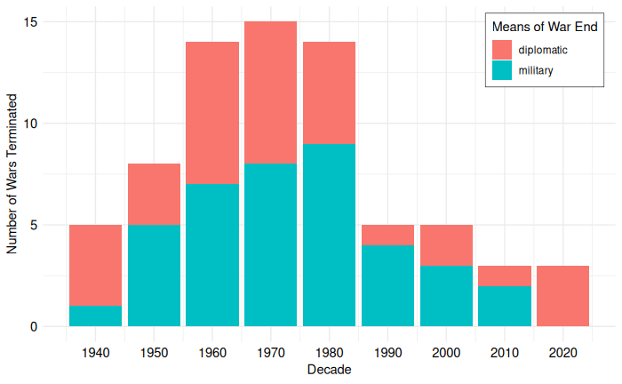
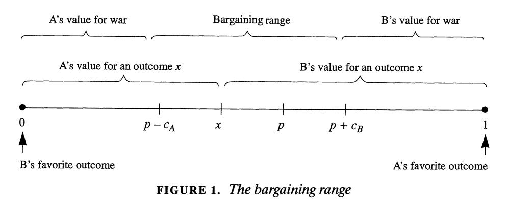

 FRCP(Glasg), [CC BY-SA 4.0](https://creativecommons.org/licenses/by-sa/4.0), via [Wikimedia Commons](https://commons.wikimedia.org/wiki/File:Clay_tablet,_Egyptian-Hittite_peace_treaty_between_Ramesses_II_and_%E1%B8%AAattu%C5%A1ili_III,_mid-13th_century_BCE._Neus_Museum,_Berlin.jpg). (P.S. Check out the [earlier peace treaty carved on a wall](https://en.wikipedia.org/wiki/Egyptian%E2%80%93Hittite_peace_treaty).)](images/HowWarsEnd_Treaty.jpg)

U.S.-Iran, Russia-Ukraine, Israel-Palestine - the wars of the world continue to incite urgent calls for action. But peace often seems hard to come by. Even when it seems like peace is in the best interests of both sides, negotiations often end in failure. When a ceasefire or peace agreement is agreed upon, there is no guarantee that it will hold. Still, no war has gone on forever. How, then, do wars end? 

This living literature review is focused on how contemporary, interstate wars end. It will:

* review the data on how wars have ended since WWII
* summarize the main theories on obstacles to peace
* offer examples of how those theories help us understand the wars in Ukraine and Iran.

## The Data on War Termination

From 1946-2023, there have been 52 interstate wars.^[This data is from the [Uppsala Conflict Data Program](https://ucdp.uu.se/downloads/). It includes armed conflicts over government or territory where two parties use armed force. One party must be the government. The conflict must result in 25 battle-related deaths in a calendar-year.
Kreutz, Joakim (2010) How and When Armed Conflicts End: Introducing the UCDP Conflict Termination Dataset. Journal of Peace Research 47(2).] Within those wars, conflicts ended 72 times: 39 by military means - either victory or simply petering out^[As an example of war termination by ‘low activity,’ Eritrea and Ethiopia’s long-running border dispute kept a low casualty count until 2016, when a major battle exceeded the dataset’s 25 annual deaths threshold. No fatalities between the states were recorded in 2017, dropping the conflict from the dataset with the outcome recorded as ‘low activity’.] - and 33 through diplomacy - either a ceasefire or peace agreement. But of those 72 war terminations, 54 held for longer than 10 years. The other 18 resumed. Conflicts ended diplomatically were less likely to resume within 10 years (15% vs 33%). Even among when conflicts did resume in 10 years,  after a diplomatic settlement, the cessation of hostilities lasted longer on average (6.4 years vs 3.1).

## The Puzzle of War

War is costly. People die, material goods are destroyed, land is scorched, and wealth is spent. Thus, the basic puzzle of war: if war is so costly, why can’t the two sides reach a peace deal that spares them the cost and instead divides them in a way that leaves both sides better off?

Consider the following ridiculously contrived scenario. As two escaped prisoners, Aspen and Brooks, are hiding in a dark alley, they spot a bag of cash. They can agree to share it in some way, and if they can’t agree, they can fight over it. They both know they each have a 50% chance of winning the fight and claiming all the money for themselves as the other concedes, but regardless of who wins, they will both suffer a cost in terms of cuts and bruises. There’s no other consequence to fighting; no one will see them, and neither escapee will report the fight to the police. The rational thing for them to do is to agree to split the money 50-50 and forgo any bodily harm. 

The logic of this scenario is presented as a formal model in Fearon (1995) to show how the costs of conflict create a bargaining range of agreements preferable to war.^[Fearon, James D. 1995. “Rationalist Explanations for War.” International Organization 49 (3): 379–414.] In the model, sides A and B are in conflict over some set of issues that can be settled on a range from 0 to 1. Side A prefers outcomes closer to 1, Side B prefers outcomes closer to 0. They can agree to some outcome between 0 and 1, or they can fight. If they fight, A wins some probability p, so B wins with probability 1-*p*; for Aspen and Brooks, *p* was 0.5, giving each a 50% chance. Each side also suffers a cost for fighting, c~A~ and c~B~ respectively. This model is summarized in Fearon’s Figure 1, shown below in Figure 2. The key insight is that there is a Bargaining range of potential agreements that both sides would prefer to fighting. This space is created by the cost of war that each would pay if they fight. 

## The Barriers to Peace

The most salient challenges to peace can be organized into three groups based on their underlying assumptions. The **Realist Reasons** assumes states are rational, unitary actors that face challenges around uncertainty, commitment, and multi-state wars. The **Domestic Reasons** assume states are rational but not unitary, so the costs and benefits of war may be distributed in such a way that some groups prefer war over peace. The **Psychological Reasons** point out that humans are not rational, and there are specific ways in which human irrationality presents an obstacle to peace.

### Uncertainty

If each state could peer into the future and see exactly how the war would end, one or both sides might try to avert the conflict. Unfortunately, the future is hard to predict, and there are many reasons why it is especially difficult to predict war costs and outcomes. For one, states are often deliberately trying to keep some information secret. War plans and weapon projects are classified and undisclosed. Ambushes, first strikes, and the element of surprise are seen as beneficial. States also have strong incentives to bluff and appear stronger than they actually are in order to lower their opponent’s confidence of victory and get a better deal. States may also misinterpret signals, perceiving aggression in an opponent’s action that was, in reality, more defensive or even benign.

Uncertainty makes peace difficult because it shrinks or even eliminates the bargaining range. The bargaining range exists because war has costs and because the probabilities of victory, *p* and 1-*p*, add up to 1. But if the probabilities of victory add up to more than 1, or more precisely if one side believes its probabilities that add up to more than 1, that bargaining range disappears. This could be because both sides believe they are more likely to win than not (60% to 60%), or it could be because one side believes it is likely to lose but not as badly as the other side thinks (90% to 30%). The bargaining range could also narrow if either or both sides underestimate their costs of conflict; as perceived costs move towards 0, the bargaining space disappears. 

### Making Credible Commitments

If two states commit to a ceasefire or peace agreement that is mutually preferable to war, they have to be able to trust each other to follow through on the agreement. Each side’s commitment to the deal must be credible. This is a challenge, as agreements usually contain deescalatory steps such as disarmament that would leave a state more vulnerable to an attack in the future. If parts of the agreement lower one side’s chance of military victory (p from the model), the other side has an incentive to break the agreement and continue the war against a weakened foe.

The challenges of uncertainty and credible commitments have different implications for how and when a war will end. If the main barrier to peace is uncertainty about each side’s strength and the costs of war, then the war itself will provide that information and create a bargaining range. If the main barrier is credible commitments, fighting the war does not solve that problem, suggesting the war may go on for longer.^[Jackson, Matthew O., and Massimo Morelli. 2011. “The Reasons for Wars: An Updated Survey.” In The Handbook on the Political Economy of War. Edward Elgar Publishing. https://www.elgaronline.com/downloadpdf/edcollchap/edcoll/9781848442481/9781848442481.00009.pdf.]

### Multi-state Conflicts

As we add more states to a conflict, it can become even harder to achieve peace. Imagine a situation with three states where any two states together can defeat the third. As the three states near an agreement splitting their resources three ways, there are strong incentives for any pair of states to ally against the third and split the spoils two ways. The ability to change alliances makes any agreement unstable.^[Jackson, Matthew O., and Massimo Morelli. 2011.] 

The presence of additional parties can also contribute to uncertainty in a conflict between two states. If two states are at war and a third party is providing support to one of the states, each side’s predictions of their chance of victory and the cost of the conflict also depend on the motives and capabilities of that third state. Additionally, that third state has incentives to bluff about its resolve to get a better agreement for its ally.

### Uneven Domestic Distribution 

So far, we have talked about states as if they are unitary actors, while in reality, they are collections of many different groups and individuals. One of the most common challenges in peacebuilding is the role of third-party spoilers within states. Even if the bargaining range discussed above exists for the states, there may be actors for whom the benefits of war continue to outweigh its costs. Uncertainty and credible commitment challenges still affect groups, but now there is an additional challenge of uneven or differential distribution of the benefits and burdens of war domestically. 

The uneven distribution problem could be resolved by redistributing the benefits of peace from those who want peace to those who prefer war, so that everyone would prefer peace.^[Davis, Jason Sanwalka. 2023. “War as a Redistributive Problem.” American Journal of Political Science 67 (1): 170–84. https://doi.org/10.1111/ajps.12623.] However, the reality of such a redistribution seems politically untenable. For example, imagine a state where conscripted soldiers greatly benefit from peace, and military contractors benefit from war and are blocking a peace agreement. This problem could be solved if the conscripted soldiers paid off the military contractors to go along with a peace agreement, and everyone would be better off. Even though such side-payments would leave the conscripted soldier better off overall, it is hard to imagine anyone proposing and enacting such a morally questionable transfer scheme.

The specific incentives of leaders depend on the regime type of their government and whether they are culpable for the war, meaning they or a closely related predecessor were in power when the conflict started. Culpable leaders of democracies and high-vulnerability autocracies face greater consequences for losing wars, so they may be willing to accept a wider range of peace agreements.^[Croco, Sarah E., and Jessica LP Weeks. 2016. “War Outcomes and Leader Tenure.” World Politics 68 (4): 577–607.]

### Human Psychology

The above barriers to peace assume that states and leaders are acting rationally in terms of making choices that are in their best interests after weighing costs and benefits. However, humans have cognitive biases that may lead to deviations from the rational-actor assumption, several of which can pose challenges to peace.^[Stein, Janice Gross. 2002. “Psychological Explanations.” Handbook of International Relations, 292.] 

**Confirmation bias** is the tendency to believe information that confirms your pre-existing beliefs and discount information that goes against them. This bias may make it difficult for a state to believe that its opponent is truly interested in peace and can be trusted to respect a ceasefire. 

Under the **fundamental attribution error**, humans attribute others’ actions more to their personality than to their situation.  Imagine two states are both increasing military spending for purely defensive motives. Each side is more likely to attribute their opponent’s actions to their personality (they are arming because they are aggressive) instead of the situation or context (they are arming to protect themselves in a dangerous world). 

Humans over-emphasize loss over gain in what is called **prospect theory** or **loss aversion**. This means that we feel more pain from losing something than we feel pleasure in gaining the same thing. Thinking back to the game model, this loss aversion can shrink the bargaining space if a state evaluates a concession as having a higher cost than its adversary does. 

## Overcoming Barriers

Understanding the barriers to peace can also help us understand why some ceasefires last longer than others. Ceasefires last longer when they have more mechanisms to reduce uncertainty, demonstrate credibility, raise the cost of violation, regulate risky activities, and prevent accidents. Buffer zones are especially effective.^[This research also found that ceasefires last longer when they raise the cost of violation, regulate risky activities, and prevent accidents; buffer zones are especially effective.
Fortna, Virginia Page. 2003. “Scraps of Paper? Agreements and the Durability of Peace.” International Organization 57 (2): 337–72.]

Third-party guarantors, such as peacekeepers, can help adversaries solve the credible commitment problem. Peace agreements last longer when an agreement includes peacekeepers.^[Fortna, Virginia Page. 2003. “Inside and out: Peacekeeping and the Duration of Peace after Civil and Interstate Wars.” International Studies Review 5 (4): 97–114.] The rise of UN peacekeeping can help explain why, before the end of WWII, 90% of wars ended in military victory compared to only 50-60% of wars after.^[Fortna, Virginia Page. 2009. “Where Have All the Victories Gone? Peacekeeping and War Outcomes.” Peacekeeping and War Outcomes. https://papers.ssrn.com/sol3/papers.cfm?abstract_id=1450558.] 

## Barriers to Peace In the News

Do these barriers to peace show up in the news of actual, ongoing wars? While we are not privy to what world leaders are thinking, I offer the following as highly suggestive examples based on the least-paywalled sources I could find.

### Uncertainty over the Strait of Hormuz

The [United States reportedly underestimated](https://www.cnn.com/2026/03/12/politics/hormuz-trump-administration-underestimated-iran) Iran’s willingness to close the Strait of Hormuz. The administration thought that closing the Strait would hurt Iran more than the US. This view was bolstered by the fact that after [the US bombed Iranian nuclear sites in June 2025](https://www.cnn.com/world/live-news/israel-iran-conflict-06-21-25-intl-hnk), [Iran’s parliament endorsed closing the Strait of Hormuz](https://www.usatoday.com/story/news/world/2025/06/22/iran-parliament-strait-of-hormuz-closure/84307368007/) but never did ([perhaps at China’s behest](https://www.reuters.com/world/china/us-urges-china-dissuade-iran-closing-strait-hormuz-2025-06-22/)). This uncertainty over the costs of conflict may have reduced the Bargaining space early in the conflict. Now that Iran has demonstrated its ability to close the strait, there is the challenge of how Iran can credibly commit to keep it open as part of an agreement.

### Russia, Ukraine, and Credible Commitments

Last December, Ukraine proposed a [20-point framework](https://www.reuters.com/world/ukraine-unveils-20-point-peace-proposal-under-discussion-with-us-2025-12-24/) for its talks with the US to negotiate an end to its war with Russia. The second point is a non-aggression agreement between Russia and Ukraine. The third is “Ukraine will receive robust security guarantees.”

The demand for guarantees suggests that Ukraine would not trust an agreement alone because Russia cannot credibly commit to honor such an agreement. Ukrainian President Zelensky relayed that [the US proposed 15-years of security guarantees](https://www.politico.eu/article/volodymyr-zelenskyy-ukraine-peace-plan-to-national-referendum-us-security-guarantees/). Zelensky said, “I told him that we would really like to consider the possibility of 30, 40, 50 years.”

### Multi-state Conflicts: Iran, USA, Israel, and Lebanon

On April 8, [the United States and Iran agreed to a ceasefire](https://www.cnn.com/2026/04/08/middleeast/us-iran-ceasefire-explainer-war-intl-hnk) mediated by Pakistan’s Prime Minister Shehbaz Sharif. [Sharif announced on X](https://x.com/cmshehbaz/status/2041665043423752651) that the parties agreed to a ceasefire “everywhere, including Lebanon.” Hours later, [Israel stated](https://www.bbc.com/news/live/c5yw4g3z7qgt?post=asset%3Ac8a52968-d1fe-445e-ade3-7df9ab1cb882#post) that Lebanon was not included in the ceasefire and [attacked](https://www.nbcnews.com/world/lebanon/lebanon-israel-attack-iran-ceasefire-hezbollah-rcna267260). In response, [Iran reportedly closed the Strait of Hormuz](https://www.cbsnews.com/live-updates/iran-trump-ceasefire-strait-hormuz-israel-war-hezbollah-continues/).
