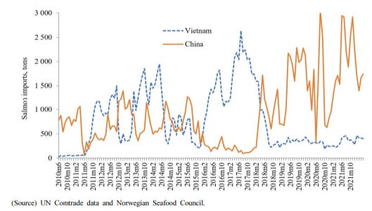
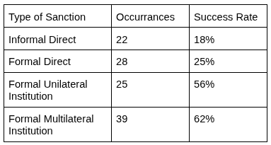

 (Out by the Salmon Net) by Norwegian painter Fredrik Kolstø, 1892](images/InformalSanctions_Kolsto.jpg)

The Nobel Committee awarded the 2010 Peace Prize to Liu Xiaobo for human rights efforts in China. A month after the ceremony, the Chinese government bureau in charge of China’s import inspections announced new inspections for imported salmon. Salmon that had flown from to China with just enough ice for the flight started to rot while awaiting inspections.[^1]

[^1]: Chen, Xianwen, and Roberto Javier Garcia. 2016. “Economic Sanctions and Trade Diplomacy: Sanction-Busting Strategies, Market Distortion and Efficacy of China’s Restrictions on Norwegian Salmon Imports.” China Information 30 (1): 29–57. https://doi.org/10.1177/0920203X15625061. 40.

The Nobel Prize and the rotting salmon are connected through an excellent demonstration of informal sanctions. Building on our recent review of [economic sanctions](https://abroadreview.com/posts/EconomicSanctions.html) this post reviews the research on informal sanctions using the salmon sanctions as an example of why and how informal sanctions can play out. Research suggests informal sanctions are not as successful as formal sanctions, but they allow for plausible deniability that reduces their risk of retaliation.

## The Salmon Story

The Nobel Prize committee is made up of five members appointed by Norway’s parliament to six-year terms. Beyond that, the Norwegian government has no control over who the Committee awards. Still, after [China condemned](https://www.bbc.com/news/world-asia-pacific-11505164) the decision to give the Peace Prize to Liu Xiaobo, it wanted to punish Norway.

China decided to hit Norway by going after its salmon. Nearly [30%](https://www.cmi.no/publications/5805-too-big-to-fault) of Norway’s exports to China were fish, making it Norway’s largest export category to China. China imposed regulations on salmon imports for supposed health reasons. China first required additional sanitation testing and veterinary inspection of all salmon. This reportedly took 3-4 days for most shipments, except for Norwegian salmon, which took up to 20 days. China then modified how import licenses were processed. Importers of Norwegian salmon only received licenses to import 10-30 tons when previously they routinely were allowed up to 200 tons.[^2]

[^2]: Chen and Garcia 2016, 39.

From 2011-2013, Norway’s share of China’s salmon market [dropped from 92% to 29%](https://www.cnbc.com/2013/08/15/norway-sees-liu-xiaobos-nobel-prize-hurt-salmon-exports-to-china.html). Over that time, the sanctions reduced Norway’s total fish exports to China by 123-176 million U.S. dollars.[^3] Norway [complained](https://tradeconcerns.wto.org/en/stcs/details?imsId=319&domainId=SPS) to the World Trade Organization that “China's measures did not seem to be based on scientific principles or a risk assessment.” China responded with its concerns about fish lice and other pathogens.

[^3]: Kolstad, Ivar. 2020. “Too Big to Fault? Effects of the 2010 Nobel Peace Prize on Norwegian Exports to China and Foreign Policy.” International Political Science Review 41 (2): 207–23. https://doi.org/10.1177/0192512118808610.

While official trade data shows that Norway’s salmon exports to China decreased with the informal sanctions, that data does not account for indirect exports to China, such as salmon smuggled in through Vietnam. Figure 2 shows that Norwegian salmon imports to Vietnam rose drastically in 2011 and spiked whenever imports to China dropped until the restoration after 2017.[^4] In 2018, a crackdown on the Triads, a Chinese crime syndicate, impacted smugglers; afterwards, [salmon prices spiked](https://www.seafoodsource.com/news/supply-trade/salmon-smuggling-update-china-cracking-down-on-triad-gangs), supporting the theory that salmon was being smuggled into China.

[^4]: Garcia, Roberto J., and Thi Ngan Giang Nguyen. 2023. “Market Integration through Smuggling.” Journal of Economic Integration 38 (1): 93–114.

Still, China’s salmon sanctions may have won some political concessions from Norway. In 2011, Norway voted with China on a United Nations resolution while the rest of the European Union abstained. In 2014, the Norwegian government declined to meet the Dalai Lama, whom China sees as a threat to its control over Tibet. In 2016, China and Norway issued a [delicately worded statement](https://en.wikisource.org/wiki/Statement_of_the_Government_of_the_People%27s_Republic_of_China_and_the_Government_of_the_Kingdom_of_Norway_on_Normalization_of_Bilateral_Relations) that acknowledged that China-Norway relations deteriorated because of the Nobel Peace Prize and affirmed that the Norwegian Government would not support actions that undermine China’s core interests.[^5]

[^5]: Kolstad 2020.

Norway’s salmon exports to China were restored through an agreement in 2017 and a salmon-imports protocol in 2019. Trade balances returned to normal as Norway’s salmon exports to Vietnam plummeted and exports to China shot up. In fact, Norwegian salmon exports to China just hit a monthly record in July 2026, which some attributed to an ad campaign featuring Norwegian soccer star Erling Haaland.

, Wang Gang / Future Publishing via Getty Images](images/InformalSanctions_Haaland.jpg)

## What Are Informal Sanctions?

China’s use of health regulations to hurt Norway through its salmon businesses is an example of informal sanctions. To review, [economic sanctions](https://abroadreview.com/posts/EconomicSanctions.html) are laws that restrict interstate exchange with the goal of coercing a target state into policy change, containing its capabilities, or denying it resources. Informal sanctions are similar to economic sanctions in that they are instigated by the government, they disrupt market transactions, and they have a political and strategic objective. The key difference is that informal sanctions are not publicly declared as sanctions and do not run through official legal sanction frameworks.[^6]

[^6]: Lim, Darren J., and Victor A. Ferguson. 2022. “Informal Economic Sanctions: The Political Economy of Chinese Coercion during the THAAD Dispute.” Review of International Political Economy 29 (5): 1525–48. https://doi.org/10.1080/09692290.2021.1918746.

Motivations are a key factor in identifying informal sanctions. States often impose regulations on interstate exchange for many reasons, including health and safety. For example, cars imported to the United States are required [by U.S. law](https://www.cbp.gov/trade/basic-import-export/importing-car) to meet certain standards for emissions, bumpers, and safety; are subject to a gas-guzzler tax and a 2.5% duty tax (25% for trucks); and must have their undercarriages thoroughly cleaned to prevent the spread of pests. All of these laws impose restrictions on interstate exchange, but the United States did not create them to coerce, contain, or deny target countries, so they are not considered sanctions at all.

However, health and safety regulations act as informal sanctions if they are targeted in a strategically motivated way to coerce their target, as China did against Norway. Russia has often imposed informal sanctions by using sanitary concerns to justify bans on goods including Polish pork, Moldovan plums, and Dutch flowers, and inspections and closures of businesses like McDonald’s and Burger King.[^7]

[^7]: Ferguson, Victor A. 2025. “Putting Your Money Where Your Mouth Is Not: China and Russia’s Implementation of Economic Sanctions.” Journal of Global Security Studies 10 (3).

Governments can also informally sanction by directing domestic businesses to limit their interaction with another country's interests. For example, after South Korea deployed a new missile defense system, China informally blacklisted South Korea by verbally instructing travel agents to stop selling group tours to South Korea. There was no law banning such tours, but the travel agents were threatened with fines and revoked licenses if they didn’t comply.[^8] Blacklisting is mainly used in industries dominated by a few firms.[^9]

[^8]: Lim and Ferguson 2022.

[^9]: Fersuson 2025.

National boycotts can also serve as informal sanctions when governments can instigate them by mobilizing patriotic consumers. The South Korean missile defense system was built on a golf course as a land-swap with the Lotte Group, a multinational conglomerate. In response, China’s state-run media ran articles encouraging Chinese consumers to boycott Lotte. This, along with other informal sanctions, caused Lotte’s net profits in the Chinese market to drop 95% that quarter.[^10]

[^10]: Lim and Ferguson 2022, appendix p 10.

## The Pros and Cons of Informal Sanctions

Informal sanctions provide a government with plausible deniability that they are imposing sanctions at all. Plausible deniability makes it easier to avoid running afoul of World Trade Organization (WTO) rules, reduces diplomatic fallout, and may make it harder for the target to respond. Also, if the informal sanctions fail, it is easier for the imposing government to end them without appearing weak.[^11] China and Russia have historically criticized unilateral sanctions, so they may also use informal sanctions to avoid accusations of being hypocritical.[^12]

[^11]: Lim and Ferguson 2022, p 1540.

[^12]: Ferguson 2025.

There are downsides to informal sanctions. Formal [economic sanctions](https://abroadreview.com/posts/EconomicSanctions.html) are more likely to succeed when the target is more dependent on trade with the sanctioning country, when the sanctions are imposed by a coalition of countries, and when the demands are clear and precise. With informal sanctions, the second and third criteria are much more difficult if not impossible.

In addition, informal sanctions require additional conditions to be effective while maintaining implausibility. To impose informal sanctions through regulations, a state must already have regulations in place that it can wield in a targeted way, such as China’s pre-existing inspection regulations and import licenses.[^13] Consumer boycotts require state-run media or a friendly propaganda network for the state to spread information supporting the boycott, and the country must have market share large enough for a boycott to hurt the target.[^14]

[^13]: Lim and Ferguson 2022.

[^14]: Wong, Audrye, Leif-Eric Easley, and Hsin-wei Tang. 2023. “Mobilizing Patriotic Consumers: China’s New Strategy of Economic Coercion.” Journal of Strategic Studies 46 (6–7): 1287–324. https://doi.org/10.1080/01402390.2023.2205262.

Another challenge to informal sanctions is that they are harder to enforce. The less involved a state is in the informal sanction, the more plausible the deniability. Once states start enforcing consumer boycotts is becomes a state boycott and loses plausible deniability.[^15] Enforcing formal sanctions is challenging even when governments can be direct about it; it only becomes more difficult when instructions about ‘secret quotas’ and ‘targeted inspections’ must be kept discreet.[^16]

[^15]: Wong et al 2023.

[^16]: Lim and Ferguson 2022, p 1541.

Generally, China imposes formal sanctions when the US and its allies threaten China’s key interests such as Taiwan, but targets those sanctions narrowly, such as when it [sanctioned Nancy Pelosi for visiting Taiwan](https://www.reuters.com/world/asia-pacific/china-sanctions-pelosi-over-provocative-visit-taiwan-2022-08-05/). This approach may thread the needle between signalling resolve against a key adversary and doing so at a level that doesn’t provoke a direct response, all while claiming the national security exception that is allowable under WTO rules.[^17] China opts for informal sanctions against other countries, which may still prove effective due to China’s economic importance but can avoid challenges from international agreements like the WTO.[^18]

[^17]: Zhang, Ketian Vivian. 2024. “Just Do It: Explaining the Characteristics and Rationale of Chinese Economic Sanctions.” Texas National Security Review, June 19. https://tnsr.org/2024/06/just-do-it-explaining-the-characteristics-and-rationale-of-chinese-economic-sanctions/.

[^18]: Xing, Jiaying. 2025. “Informal or Formal? A Qualitative Comparative Analysis of China’s Two-Tiered Sanctions Policy.” Chinese Political Science Review, ahead of print, July 23. https://doi.org/10.1007/s41111-025-00307-0.

## The WTO in Brief

The World Trade Organization is an international organization that acts as a referee for trade. Its 166 member states have agreed to abide by [certain rules](#0). WTO members must treat all other members the same and cannot give preferential treatment. Once imported goods have arrived, they cannot be treated differently than domestic goods. If a member believes the rules have been violated, it brings the [dispute](#0) to the WTO, which will create a panel to investigate and issue a ruling. If the target state does not abide by the ruling, the complainant can get permission from the WTO to retaliate.

After China joined the WTO in 2000, its exports surged. China reallocated resources to more productive manufacturers and reduced state barriers to importing and exporting. Chinese firms, now assured that tariffs would remain low, invested in exporting to the U.S.[^19] China has been the third largest target of WTO disputes after the US and EU and has largely settled those disputes or abided by any rulings.[^20] The WTO also allows members to raise [concerns](https://tradeconcerns.wto.org/en), as Norway did against China’s salmon procedures. China has had 166 concerns brought against it, vs. 181 against the United States and 411 against the whole EU.

[^19]: Autor, David H., David Dorn, and Gordon H. Hanson. 2016. “The China Shock: Learning from Labor-Market Adjustment to Large Changes in Trade.” Annual Review of Economics 8: 205–40. https://doi.org/10.1146/annurev-economics-080315-015041.

[^20]: Wang, Chenxi, and Weihuan Zhou. 2023. “A Political Anatomy of China’s Compliance in WTO Disputes.” Journal of Contemporary China 32 (143): 811–27. https://doi.org/10.1080/10670564.2022.2109007.

## Do Informal Sanctions Work?

Informal sanctions can have a huge impact on firms. The firm Lotte ultimately closed its operations in China. A [non-academic review of China’s boycotts](https://kinacentrum.se/wp-content/uploads/2022/07/purchasing-with-the-party-chinese-consumer-boycotts-of-foreign-companies-20082021-2.pdf) found that in 90 cases, more than half of the targeted firms issued public apologies. However, informal sanctions do not seem to have much geopolitical success. South Korea went ahead with the missile defense project that initially involved Lotte. China’s favorability in South Korea dropped sharply. South Korean elections included more anti-China rhetoric, and the following administration expressed interest in additional missile defense systems.[^21]

[^21]: Wong et al 2023.

Table 1 shows the success rate of different types of sanctions based on 135 times that China has threatened or used sanctions.[^22] The most successful sanctions are when China works formally within an institution, either unilaterally (e.g., initiating a WTO dispute) or multilaterally (e.g., UN Security Council sanctions). When imposing sanctions directly, formal sanctions have a slightly higher success rate than informal sanctions.

[^22]: Zhang, Jiakun Jack, and Spencer Shanks. 2025. “Measuring Chinese Economic Sanctions 1949–2020: Introducing the China TIES Dataset.” Conflict Management and Peace Science 42 (3): 328–52. https://doi.org/10.1177/07388942241248274.

Informal sanctions are just one of many ways that states try to influence each other. Big picture, compared to other forms of sanctions, informal sanctions seem to be the least likely to succeed. Their subtlety limits their effectiveness, but it also lowers their cost as they seem more likely to avoid retaliation from multinational institutions or other states. Zooming in however, informal sanctions can cause chaos. Among its many consequences, China’s informal sanctions on Norwegian salmon led to illicit salmon smuggling through Vietnam that involved China’s most notorious crime syndicate. Moves that seem small in the global theater still have great impacts on everyday lives.

*Acknowledgements: Thanks to Kali Holder and Lucy Ouckama for draft comments. Thanks to Coefficient Giving for supporting this Living Lit Review.*
